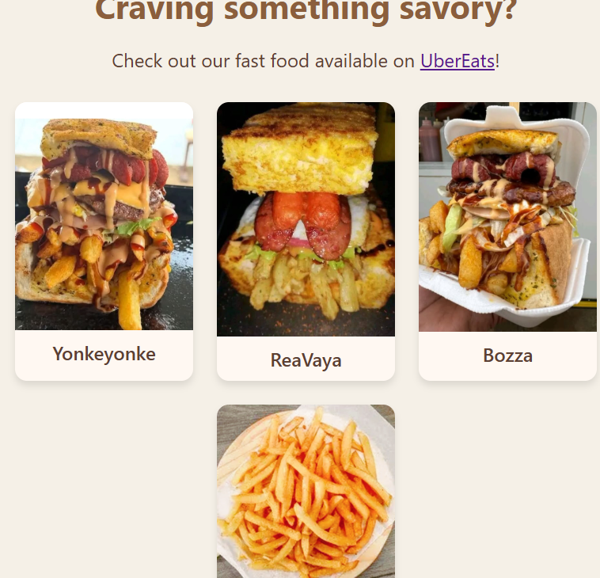
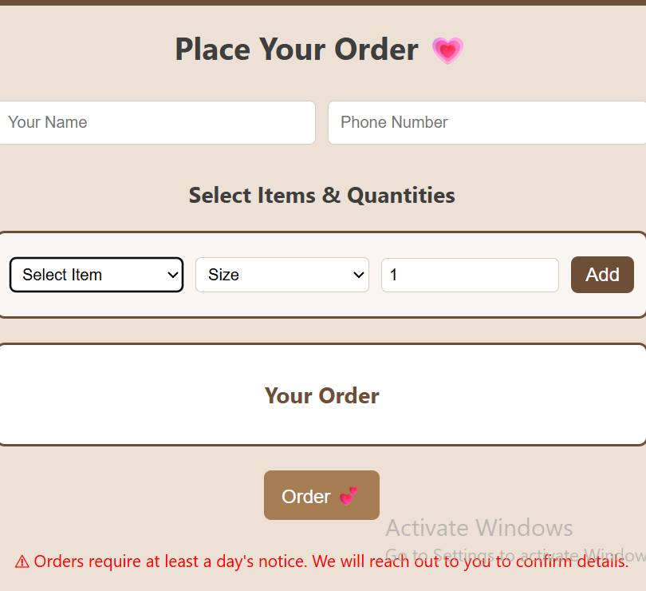

🧁 Mangope Bakery & Fast Food

A modern Spring Boot web application for managing bakery orders with a clean, user-friendly interface and real-time order building.

✨ Overview

Mangope Bakery & Fast Food is a full-stack web application designed to streamline customer ordering.
Customers can build multi-item orders with different sizes and quantities, while the business owner can view and manage orders from an admin dashboard.

🚀 Live Demo
(.....)

🖼️ Screenshots

🏠 Home Page

  
  

🧾 Order

  
  

✅ Confirmation Page

  

🔐 Admin Dashboard

  

🔥 Features

. 🛒 Dynamic Order Builder
 . Select item, size, and quantity
 . Add multiple items to a single order
 
. 📦 Multi-Item Orders
 . Supports multiple sizes per item
 . Compact UI (no excessive scrolling)
 
. 📧 Email Notifications
 . Automatic email sent when an order is placed
 
. 📊 Admin Dashboard
 . View all orders
 . Export orders to CSV
 
. 🎨 Custom UI
 . Clean layout with brand styling
 . Optimized for usability
 
. ⚙️ Tech Stack
 . Backend: Java 21, Spring Boot
 . Frontend: Thymeleaf, HTML, CSS, JavaScript
 . Database: SQLite (development), PostgreSQL (production-ready)
 . Build Tool: Maven
 
🧠 How It Works
1. Customer selects:
 . Item
 . Size (5L / 10L / 20L)
 . Quantity
2. Adds multiple items to the order
3. On submit:
 . Order is compiled into a structured format
 . Saved to the database
 . Email notification is sent
4. Admin can:
 . View all orders
 . Export them for business use
   
🛠️ Running Locally
git clone https://github.com/YOUR_USERNAME/mangopebakeryandfastfood.git
cd mangopebakeryandfastfood
mvn spring-boot:run

Then open:
http://localhost:8080

🧪 Testing
mvn test

Includes:
. Controller tests
. Service layer tests

📁 Project Structure
src/
 ├── main/
 │   ├── java/
 │   │   └── controller/
 │   │   └── service/
 │   │   └── model/
 │   ├── resources/
 │       ├── templates/
 │       ├── static/
 ├── test/
 
🚧 Future Improvements
 . 🛒 Full cart system (edit/remove items)
 . 💳 Payment integration
 . 🔐 Admin authentication
 . 📱 Mobile UI enhancements
 . 🧩 Normalize order items in database (instead of string format)
 . 📬 Contact

For inquiries or business use:
. WhatsApp: +27 XX XXX XXXX
. Email: your@email.com

## 📄 License
. This project is proprietary and developed for Mangope Bakery & Fast Food.
. All rights reserved. Unauthorized use, reproduction, or distribution of this software is not permitted without explicit permission.
